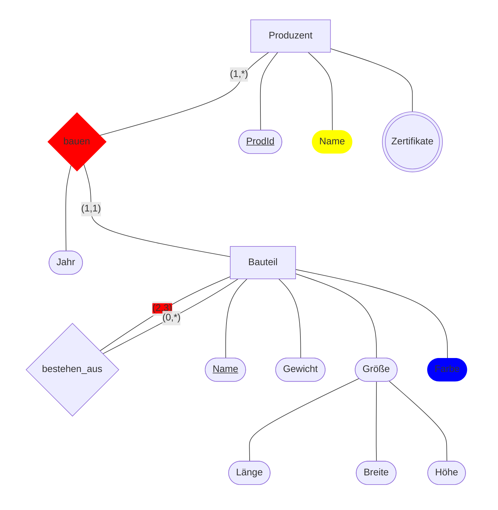

```mermaid
flowchart
    subgraph SG1 [ ]
        Produzent---P1(["`<ins>ProdId</ins>`"])
        Produzent---P2([Name])
        Produzent---P3(((Zertifikate)))
    end
    subgraph SG2 [ ]
        Bauteil---B1(["`<ins>Name</ins>`"])
        Bauteil---B2([Gewicht])
        Bauteil---B3([Größe])
        Bauteil---B7([Farbe])
        B3---B4([Länge])
        B3---B5([Breite])
        B3---B6([Höhe])
    end
    subgraph SG3 [ ]
        Produzent -- (1,*) --- herstellen{bauen}
        herstellen -- (1,1) --- Bauteil 
        herstellen---H1([Jahr])
        Bauteil -- "<span style='background-color:#ff0000'>(2,3)</span>" --- bestehen_aus{bestehen_aus}
        bestehen_aus{bestehen_aus} -- (0,*) --- Bauteil
    end    
    style SG1 fill:#ff0000,fill-opacity:0.0,stroke:#333,stroke-width:0px
    style SG2 fill:#ff0000,fill-opacity:0.0,stroke:#333,stroke-width:0px
    style SG3 fill:#ff0000,fill-opacity:0.0,stroke:#333,stroke-width:0px
    style herstellen fill:#ff0000,stroke:#333,stroke-width:0px
    style P2 fill:#ffff00, stroke:#333,stroke-width:0px
    style B7 fill:#0000ff, stroke:#333,stroke-width:0px
```